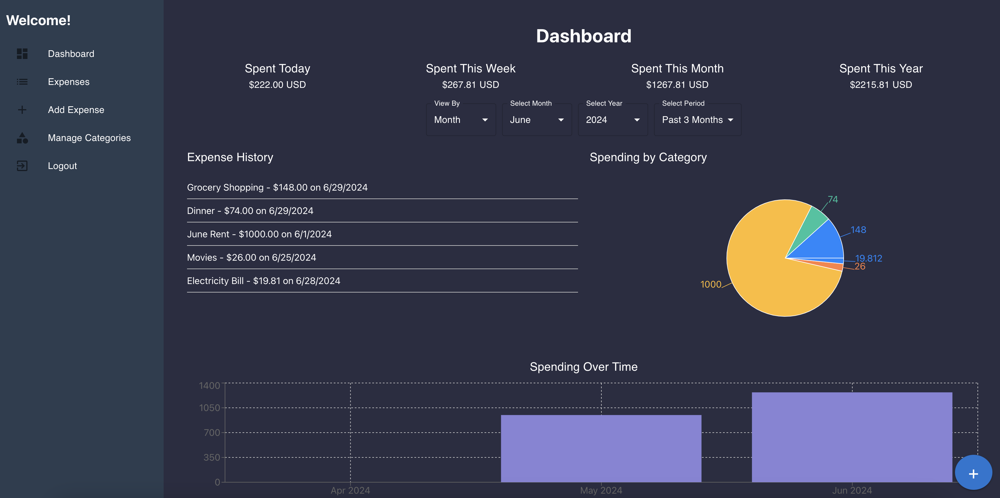
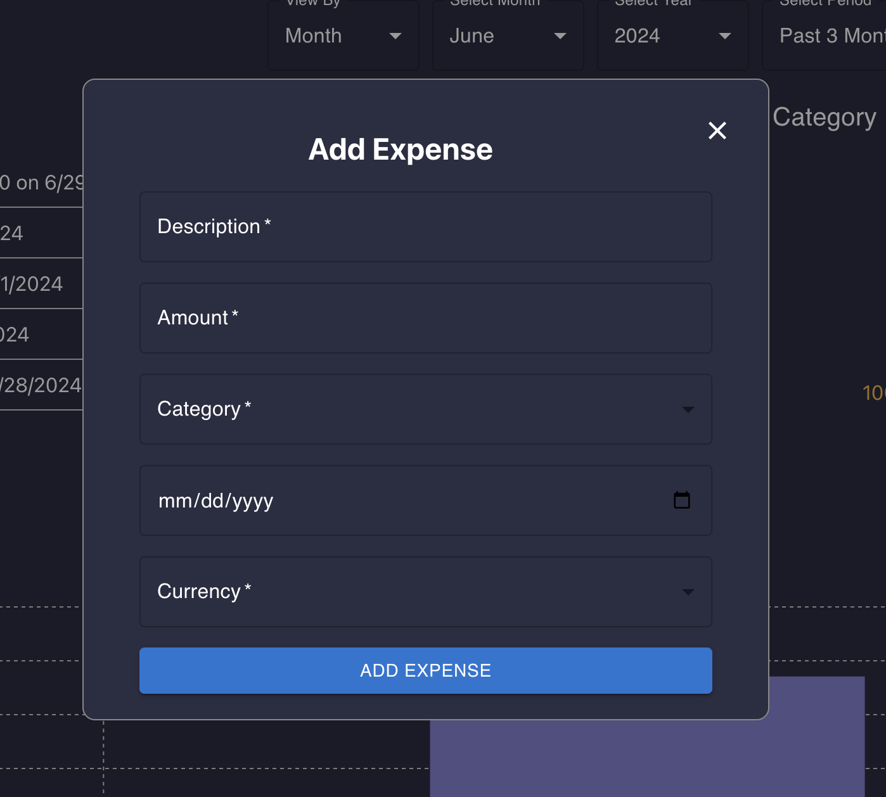
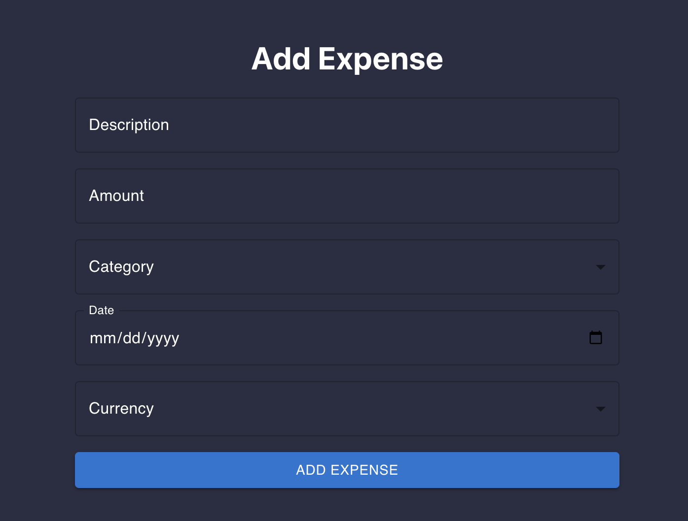
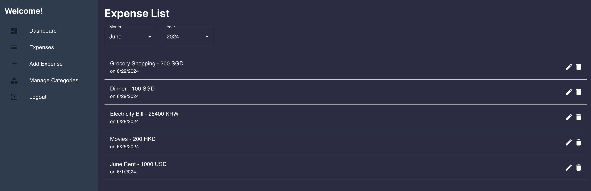
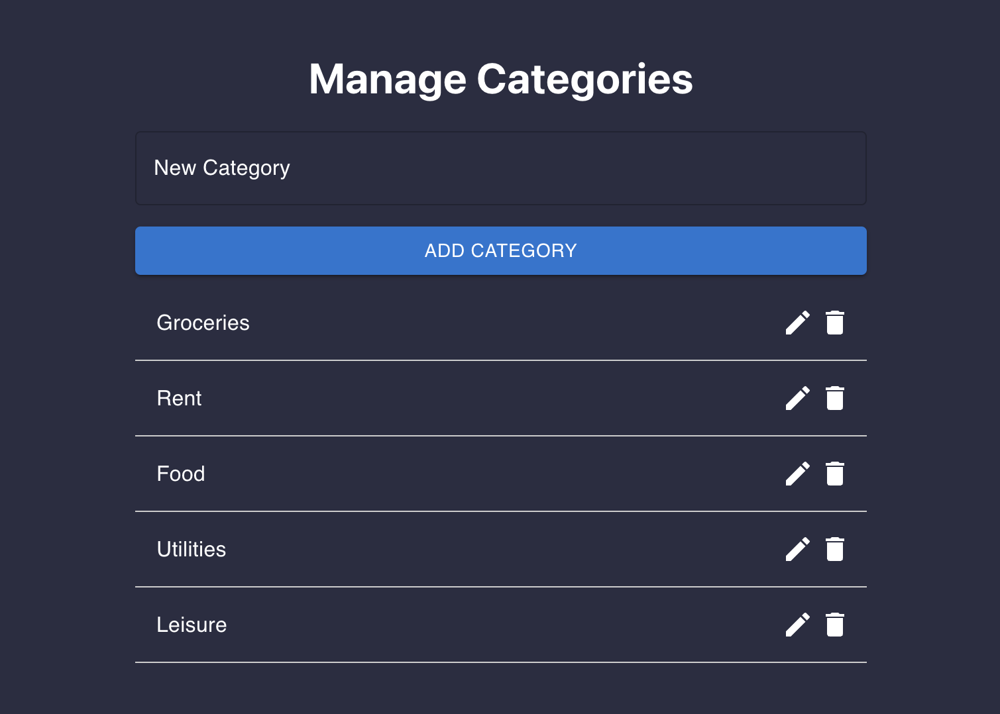
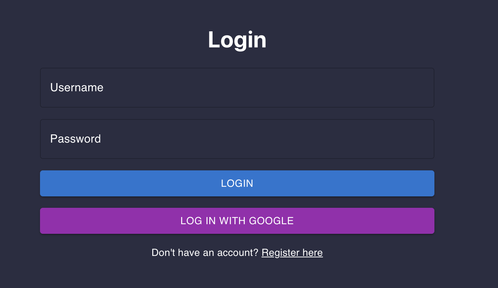
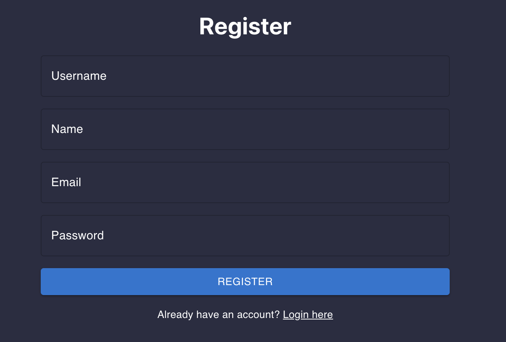

# Expense Tracker Project

This project consists of two main parts: the frontend application built with React and Material-UI, and the backend application built with Node.js, Express, and MongoDB. The application allows users to track their expenses, manage categories, and view expense history with comprehensive statistics.

## Table of Contents

- [Expense Tracker Frontend](#expense-tracker-frontend)
  - [Installation](#installation)
  - [Usage](#usage)
  - [Features](#features)
  - [Screenshots](#screenshots)
- [Expense Tracker Backend](#expense-tracker-backend)
  - [Installation](#installation-1)
  - [Usage](#usage-1)
  - [API Endpoints](#api-endpoints)
  - [Features](#features-1)
  - [Environment Variables](#environment-variables)

## Expense Tracker Frontend

This is the frontend application for the Expense Tracker project. The application is built using React and Material-UI and allows users to track their expenses, manage categories, and view expense history.

### Installation

1. **Clone the repository:**

   ```bash
   git clone https://github.com/hjungwoo01/expense_tracker.git
   cd expense_tracker/frontend
   ```

2. **Install dependencies:**

   ```bash
   npm install
   ```

### Usage

1. **Start the development server:**

   ```bash
   npm start
   ```

2. **Build the project for production:**

   ```bash
   npm run build
   ```

### Features

- User authentication (login and registration)
- Dashboard to view total expenses and statistics
- Add, edit, and delete expenses
- Manage categories
- View expense history
- Responsive design with Material-UI

### Screenshots

### Dashboard




### Add Expense



### Expense List



### Manage Categories



### Login 



### Register



## Expense Tracker Backend

This is the backend application for the Expense Tracker project. The backend is built using Node.js, Express, and MongoDB. It provides RESTful APIs for user authentication, managing expenses, and managing categories.

### Installation

1. **Clone the repository:**

   ```bash
   git clone https://github.com/hjungwoo01/expense_tracker.git
   cd expense_tracker/backend
   ```

2. **Install dependencies:**

   ```bash
   npm install
   ```

3. **Set up environment variables:**

   Create a `.env` file in the root of the `backend` directory and add the following variables:

   ```plaintext
   PORT=5000
   MONGODB_URI=your_mongodb_connection_string
   JWT_SECRET=your_jwt_secret
   ```

### Usage

1. **Start the development server:**

   ```bash
   npm run dev
   ```

   This will start the server on `http://localhost:5000`.

### API Endpoints

#### Auth

- **POST /api/auth/register**

  Register a new user.

  ```json
  {
    "username": "testuser",
    "email": "testuser@example.com",
    "password": "password123",
    "name": "Test User"
  }
  ```

- **POST /api/auth/login**

  Login an existing user.

  ```json
  {
    "username": "example",
    "password": "password123"
  }
  ```

#### Expenses

- **GET /api/expenses**

  Get all expenses for the authenticated user.

- **POST /api/expenses**

  Add a new expense.

  ```json
  {
    "description": "Dinner at Restaurant",
    "amount": 50,
    "currency": "USD",
    "category": "Dining",
    "date": "2024-06-15"
  }
  ```

- **DELETE /api/expenses/:id**

  Delete an expense by ID.

#### Categories

- **GET /api/categories**

  Get all categories for the authenticated user.

- **POST /api/categories**

  Add a new category.

  ```json
  {
    "name": "Food"
  }
  ```

- **PUT /api/categories/:id**

  Edit a category by ID.

  ```json
  {
    "name": "Groceries"
  }
  ```

- **DELETE /api/categories/:id**

  Delete a category by ID.

### Features

- User authentication with JWT
- Manage expenses (add, edit, delete)
- Manage categories (add, edit, delete)
- Secure RESTful API

### Environment Variables

The following environment variables are used in this project:

- **PORT**: The port on which the server will run (default is 5000).
- **MONGODB_URI**: The connection string for the MongoDB database.
- **JWT_SECRET**: The secret key for signing JWT tokens.